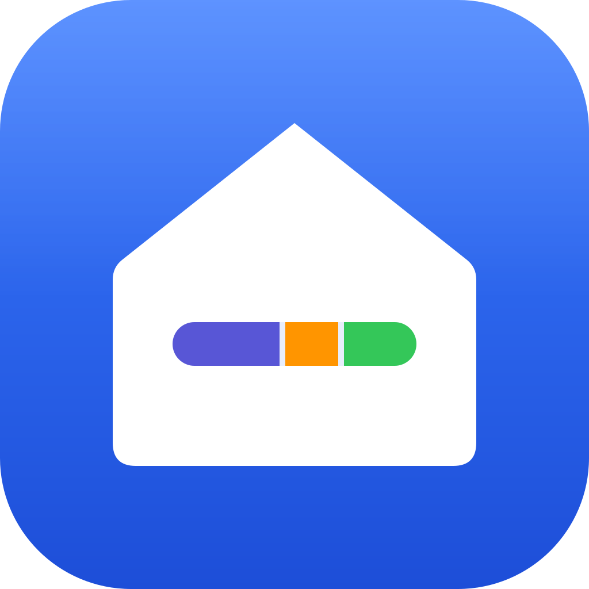
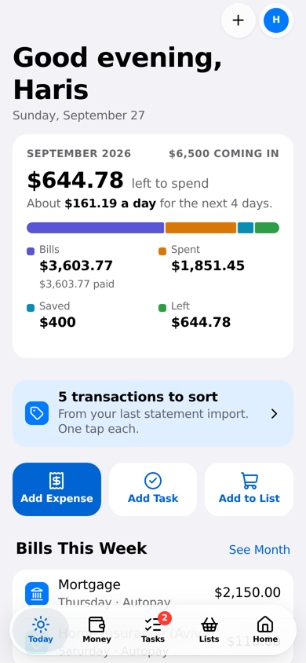
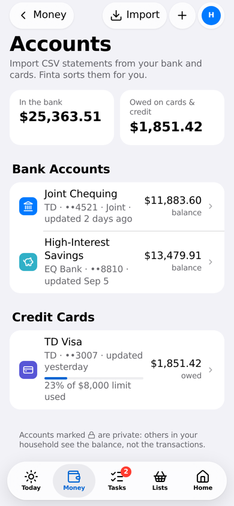
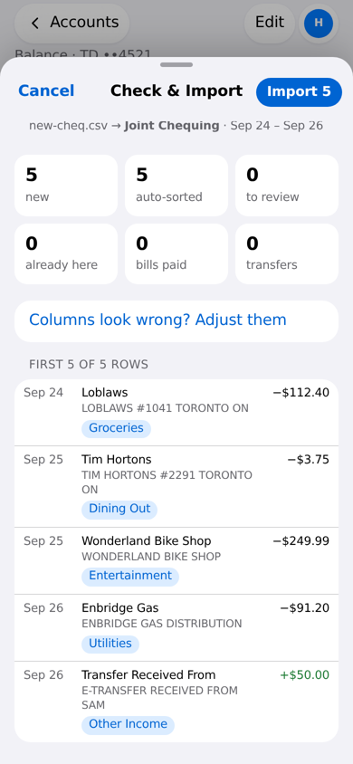
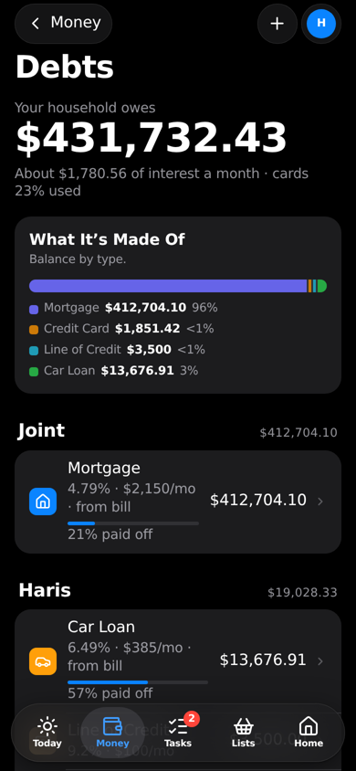
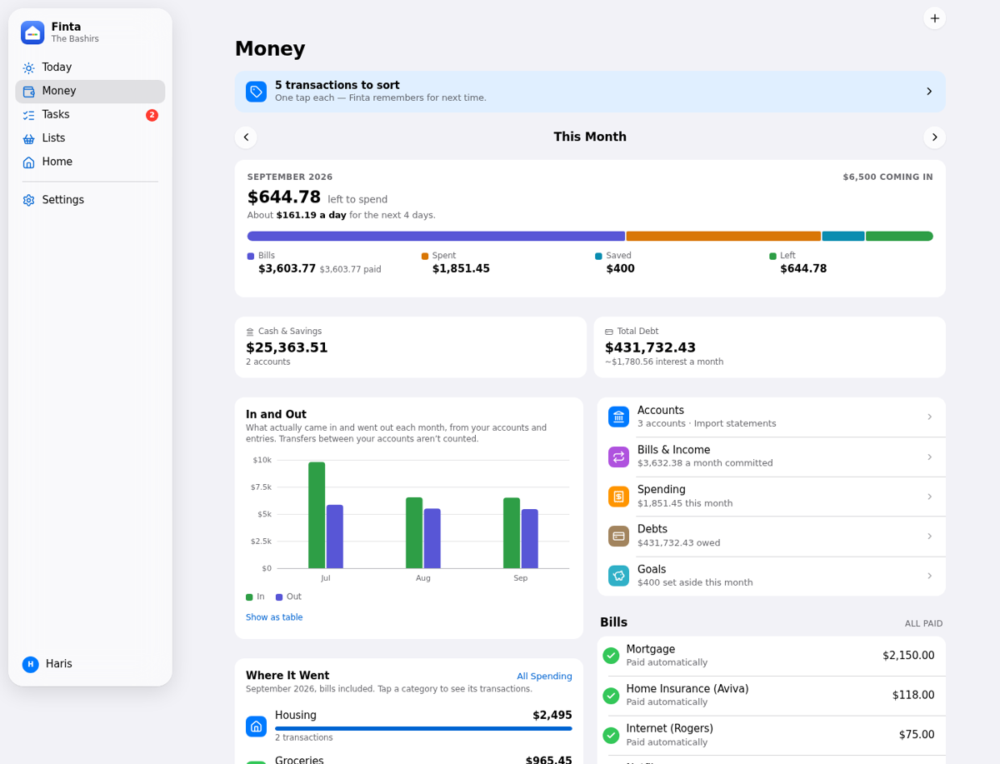

<p align="center"></p>

<h1 align="center">Finta</h1>
<p align="center">A calm, self-hosted home for your household’s money, chores, lists and meals.</p>

<p align="center">
  
  
  
  
</p>
<p align="center"></p>

---

Finta runs in a single container on your own server. Everyone in the household signs in to see the same bills, budgets, tasks, shopping lists and meal plan, on their phones and computers.

- **Money that answers one question:** *how much is left to spend this month?* Finta subtracts your bills, everyday spending and savings from your income, then tells you what that works out to per day.
- **Set it once.** Paycheques, mortgage, utilities, insurance and subscriptions repeat on their own. Autopay items tick themselves off.
- **Import your statements.** Drop in CSV files from your bank and credit cards. Finta sorts each line into a category and marks bills paid. It recognizes a card payment from chequing as a transfer, so nothing counts twice, and it learns from every correction.
- **Debts with a plan.** Mortgage, cards, credit lines, car and student loans for each person, with a payoff planner that shows your debt-free date.
- **Everyone manages their own money; the household sees the total.** Each member has their own accounts and debts (private if they like) and can switch between *Just Me* and the whole household.
- **Everything else a home runs on.** Chores and maintenance that come back on schedule, shared shopping lists, a weekly meal plan that sends ingredients to the list, your appliances and warranties, and the plumber’s number.
- **Built for the public internet.** Passkeys, two-factor codes, rate limiting, strict security headers, and invite-only accounts.
- **Nothing to install but Docker.** There are zero npm dependencies. The server is plain Node.js with its built-in SQLite, and the web app needs no build step.

## Contents

- [Quick start](#quick-start)
- [How the money works](#how-the-money-works)
- [Importing statements](#importing-statements)
- [Features](#features)
- [Security](#security)
- [Running it](#running-it)
- [Development](#development)
- [Project layout](#project-layout)

## Quick start

### On the internet, with HTTPS (recommended)

You need a server with Docker and a domain name (for example `home.example.com`) pointing at it, with ports 80 and 443 open.

```bash
git clone https://github.com/<you>/finta.git && cd finta
cp .env.example .env          # set DOMAIN and APP_URL
docker compose up -d --build
docker compose logs finta     # copy the setup code
```

Open `https://home.example.com`, enter the setup code, and create your household. Caddy gets and renews the TLS certificate automatically.

### On your own computer (try it out)

```bash
docker compose -f compose.local.yaml up -d --build
docker compose -f compose.local.yaml logs finta   # setup code
```

Then open <http://localhost:3000>. Turn on **Start with example data** during setup to explore a realistic household.

### Invite your household

Go to **Settings → Invite Someone** and send the link, or let them scan the QR code. Each link works once and expires after 7 days.

## How the money works

Finta has one model, and every money screen shows it:

```
Left to spend  =  income expected this month
               −  bills due this month       (paid or not)
               −  everyday spending so far
               −  money set aside for goals
```

| You add… | Examples | What Finta does |
| --- | --- | --- |
| **Income** | Paycheques (weekly, every 2 weeks, twice a month, monthly) | Counts every payday that falls in the month |
| **Bills** | Hydro, internet, phone, property tax | Shows what’s due and what’s paid. For **variable** bills you enter an estimate and confirm the real amount when you pay |
| **Subscriptions** | Streaming, apps, memberships | Shows the cost per month and per year, and warns you before a free trial ends |
| **Loans & mortgage** | Mortgage, car loan | Splits each payment into interest and principal, lowers the balance, and estimates your payoff date |
| **Insurance / savings transfers** | Home, car, automatic savings | Same as bills |
| **Spending** | Groceries, gas, takeout | Tap **+**, type an amount and pick a category. That’s it |
| **Goals** | Emergency fund, a trip | Tells you how much to set aside each month to hit the date |
| **Budgets** *(optional)* | Groceries $900/mo | Progress bars on the Month screen |

Every schedule counts forward from its first due date, so it never drifts. A bill due on the 31st falls on the 30th in 30-day months and on the 28th or 29th in February. **Autopay** items record their own payment on the due date. Anything else gets a tick from you, with Undo if you tap the wrong one.

## Importing statements

1. **Money → Accounts → +** to add each chequing account, savings account, credit card and line of credit. For cards and credit lines, add the rate and minimum payment so the Debts planner can use them.
2. On your bank’s website, download transactions as **CSV** for any date range.
3. Open the account, tap **Import Statement**, choose the file, check the preview, and import.

**Formats.** Finta reads what Canadian and US banks export:

| Your file has… | Example | Finta handles it |
| --- | --- | --- |
| Separate Debit and Credit columns | `Date,Details,Debit,Credit` | Debit is money out, Credit is money in |
| One signed Amount column | `Date,Description,Amount` | Negative is money out. For card files where purchases are positive, Finta flips the sign automatically, and you can change it |
| No header row | `09/01/2026,TIM HORTONS,2.45,,1000.00` | Columns are recognized by their contents |
| Any common date style | `2026-09-27`, `09/27/2026`, `27/09/2026`, `Sep 27, 2026` | Day/month order is worked out from the file |

The mapping is remembered for each account. If a column is ever wrong, open **Columns look wrong?** in the preview.

**What happens to each line**, in order:

1. **Already imported?** It's skipped, so overlapping date ranges are safe.
2. **Your rules.** Anything you've sorted before is sorted the same way.
3. **Your bills.** A line that matches a bill by name, amount and due date marks that bill paid with the real amount.
4. **Built-in knowledge.** Hundreds of merchants (Loblaws, Tim Hortons, Petro-Canada, Toronto Hydro, Netflix…) map to a category.
5. **Otherwise** it goes to **Review**. Tap a category once and Finta applies it to every similar line, now and in future imports.

**Card payments and transfers.** When money leaves one of your accounts and the same amount arrives in another within five days (a Visa payment from chequing, a move to savings), both sides are marked as a **transfer**. Transfers don't count as spending or income. Your card purchases are counted once, when you buy, not again when you pay the card.

**Recurring costs you haven't set up.** After a few months of statements, **Bills & Income** shows a *Looks Recurring* section (for example, a gym membership at the same price every month). Tap **Track**, and from then on each statement line for it marks the bill paid.

Try it with the files in [`docs/examples/`](docs/examples).

## Features

| Area | What’s there |
| --- | --- |
| **Today** | Month at a glance, bills due this week, tasks due today and tomorrow, tonight’s dinner, shopping list count, warranty and free-trial reminders |
| **Money** | Month overview with charts (In and Out for six months, Where It Went, Who Spent), cash and debt totals, bills, budgets. **Accounts** with balance charts and CSV import. **Review** for anything Finta couldn't sort. Bills & Income with *Looks Recurring* suggestions. Spending (search, filters). Goals |
| **Debts** | Everything owed, per person: balance, rate, payment, progress paid off, interest per month, card utilization. A payoff planner (highest rate first or smallest first, plus extra each month) with a debt-free date, interest saved and a chart |
| **Members** | Household → members. Accounts, bills, goals and debts belong to a person or are joint. Switch Money between the household and *Just Me*. Private accounts show others the balance but not the transactions |
| **Tasks** | Quick add, sections (Overdue, Today, Tomorrow, Next 7 Days…), chores, maintenance, errands and admin, assignees, and repeating tasks that roll forward when you tick them |
| **Lists** | Several shared shopping lists, add many items at once (“milk, eggs, bread”), no duplicates, clear what you’ve bought. Weekly meal plan with ingredients you can send to a list |
| **Home** | Things you own (room, model, serial number, price, warranty) and household contacts with tap-to-call |
| **Settings** | Profile, household (currency, time zone), members and roles, categories and budgets, passkeys, two-factor, password, devices, activity log, data export, account deletion |

Appearance follows your device, or you can pick Light or Dark in **Settings → Appearance**. The interface follows Apple’s Human Interface Guidelines. It uses a tab bar on phones and a sidebar on wide screens, sheets for focused tasks, and grouped lists. It follows the system’s light or dark appearance and adapts to Increase Contrast, Reduce Motion and Reduce Transparency. Swipe actions and Undo work throughout. See [DESIGN.md](DESIGN.md).

## Security

Finta is designed to face the internet. The highlights are below; [SECURITY.md](SECURITY.md) has the full list and explains how to report a problem.

- **Claiming the server:** a fresh install needs a one-time setup code that is printed only in the container log.
- **Accounts:** invite-only by default. Passwords are hashed with scrypt, and very common or personal passwords are refused.
- **Passkeys:** Face ID, Touch ID, Windows Hello or a security key, with user verification required.
- **Two-factor:** TOTP codes from an authenticator app (replays blocked), plus 10 single-use recovery codes.
- **Brute force:** sign-in attempts are limited per IP address, and an account locks for 15 minutes after 8 wrong passwords.
- **Sessions:** server-side, with only a hash of the token stored. Cookies are `HttpOnly`, `Secure`, `SameSite` and `__Host-` prefixed. Changing your password signs out every other device, and you can revoke any device yourself.
- **CSRF:** a custom request header, an Origin check, a Sec-Fetch-Site check and SameSite cookies.
- **Headers:** a strict Content Security Policy (no inline scripts or styles), HSTS, `frame-ancestors 'none'` and `nosniff`.
- **Isolation:** every query is scoped to your household, and references between rows are checked on write. Within a household, a member’s private accounts are enforced on the server: other members get balances and totals, never the rows.
- **Container:** runs as a non-root user on a read-only root filesystem with all Linux capabilities dropped and `no-new-privileges`.

## Running it

### Configuration

All settings are environment variables. See [`.env.example`](.env.example).

| Variable | Default | Purpose |
| --- | --- | --- |
| `APP_URL` | `http://localhost:3000` | The exact public address. Must be `https://` in production |
| `DOMAIN` | — | Used by Caddy in `compose.yaml` |
| `TRUST_PROXY` | `false` | Read the client IP from `X-Forwarded-For` (set by `compose.yaml`) |
| `ALLOW_SIGNUP` | `false` | Allow new households to sign up without an invite |
| `SETUP_CODE` | random | Fixed first-run setup code |
| `LOGIN_RATE_LIMIT` | `20` | Sign-in attempts per IP address per 15 minutes |
| `SESSION_DAYS` / `SESSION_IDLE_DAYS` | `30` / `14` | Session lifetime and idle timeout |
| `ALLOW_INSECURE_HTTP` | `false` | Allow `http://` in production. Use this only on a private network |

### Backups

All data lives in one SQLite file in the `finta-data` volume.

```bash
docker compose exec finta node server/cli.js backup           # writes /data/backups/finta-<time>.db
docker compose cp finta:/data/backups ./backups               # copy backups off the server
```

Each member can also download everything as JSON from **Settings → Export Data**.

### Admin commands

```bash
docker compose exec finta node server/cli.js reset-password you@example.com   # prints a temporary password
docker compose exec finta node server/cli.js disable-2fa    you@example.com
docker compose exec finta node server/cli.js unlock         you@example.com
```

### Updating

```bash
git pull && docker compose up -d --build
```

Database migrations run automatically when the container starts.

## Development

You need Node.js 22.13 or newer. There’s nothing to install.

```bash
npm run dev    # http://localhost:3000, restarts on change; setup code is printed in the terminal
npm test       # unit and API tests: import engine, transfers, privacy, debts, passkeys and more
```

## Project layout

```
server/
  index.js            HTTP server entry point
  app.js              request pipeline: headers → static → auth → CSRF → routes
  config.js           environment variables
  db.js, migrations/  SQLite (node:sqlite) and schema
  lib/                crypto (scrypt, TOTP), webauthn, sessions, validation, dates, finance,
                      csv (statement parsing), merchant (names & categories), importer, debts (planner)
  routes/             auth, account, household, money, accounts (import, review, rules), debts, home
  seed.js             default categories and optional example data
  cli.js              backup and account recovery
public/
  index.html, css/app.css      design system (see DESIGN.md)
  js/app.js                    shell and router
  js/charts.js                 dependency-free SVG charts with tooltips and table views
  js/views/*.js                Today, Money, Accounts, Debts, Tasks, Lists, Home, Settings, sign-in
test/                          node:test suites
```

## License

MIT. See [LICENSE](LICENSE). Icons are from [Lucide](https://lucide.dev) (ISC). QR codes are generated with [qrcode-generator](https://github.com/kazuhikoarase/qrcode-generator) (MIT). See [THIRD_PARTY_NOTICES.md](THIRD_PARTY_NOTICES.md).
